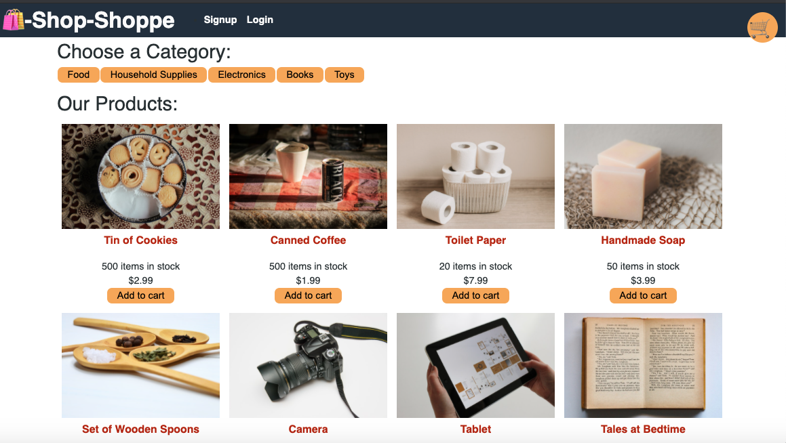

# shop-shoppe

## Description
Shop Shop is a fill-stack e-commerce platform that used the code from the Shop Shop e-commerce platform. It is refactored to now use Redux to manage global state instead of the Context API. This will remove the site's state management from the React ecosystem. On top of this, the shopping cart, offline functionality and Stripe secure online payment processing has been added. 

## Table of Contents
* [Technologies](#technologies)
* [Screenshot](#screenshot)
* [Links](#links)

## Technologies
  
  
 
  
  
 
 
   
  
  

## Screenshot
#### Homepage for storefront and cart functionality 

## Links

  

 

